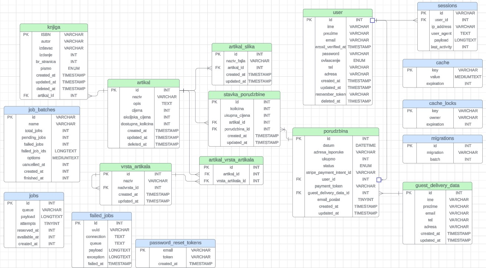
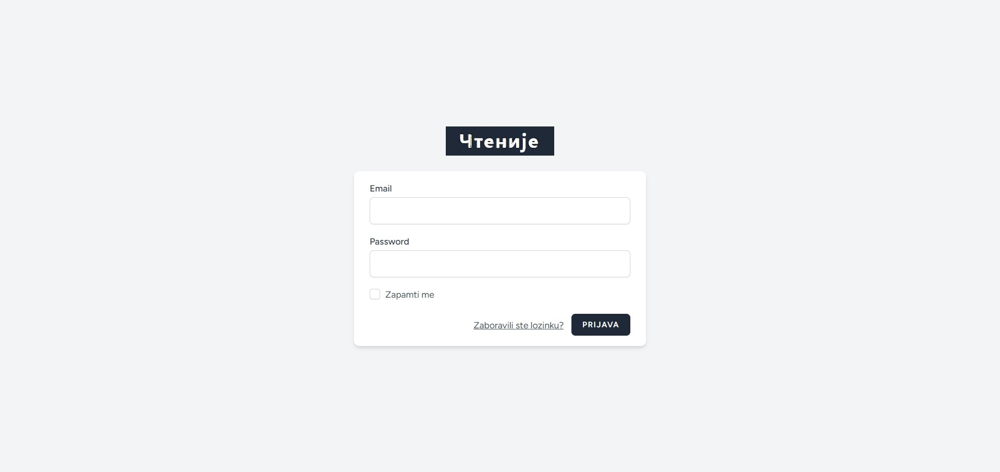
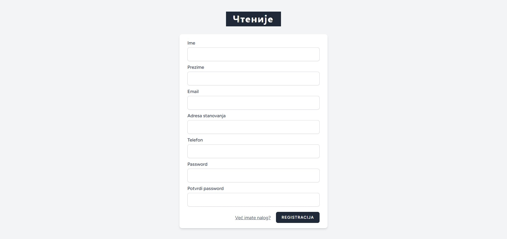
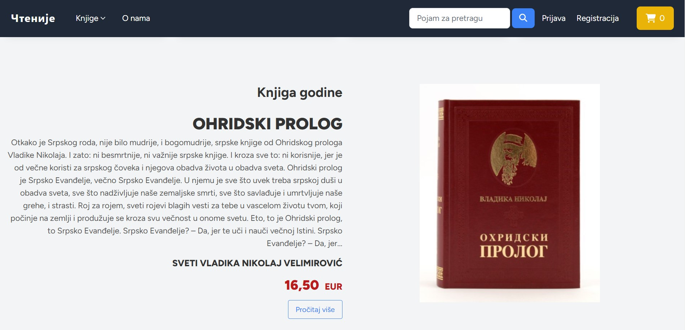
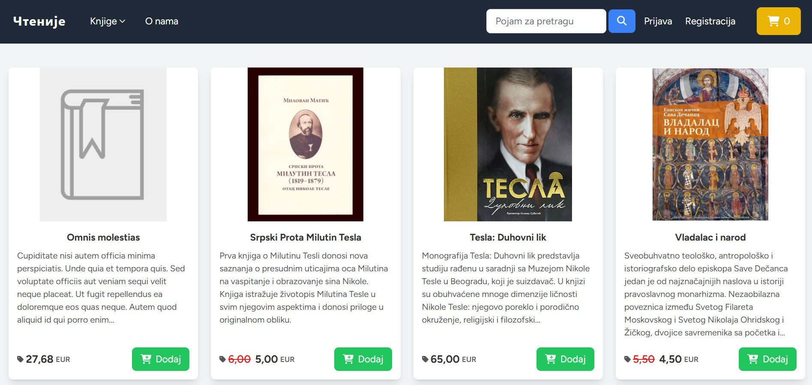
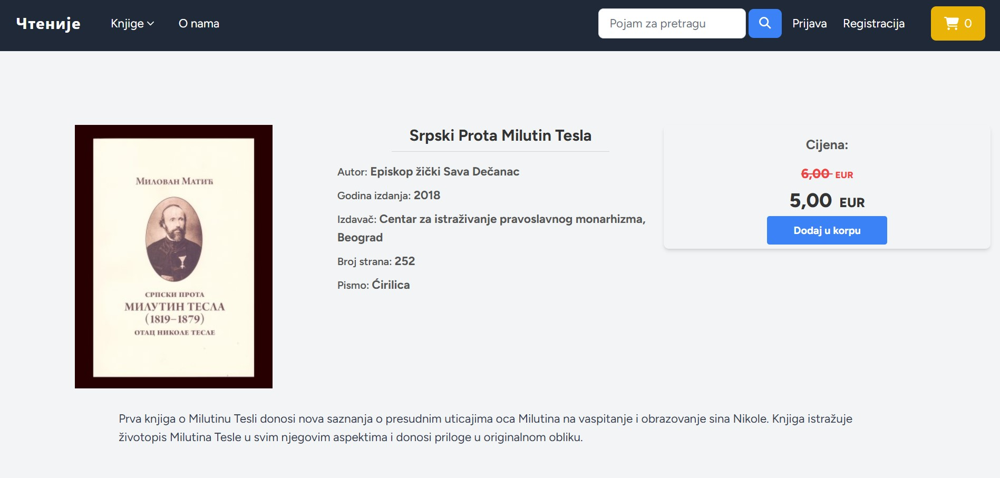
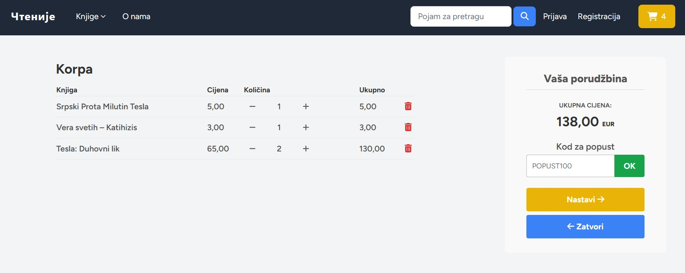
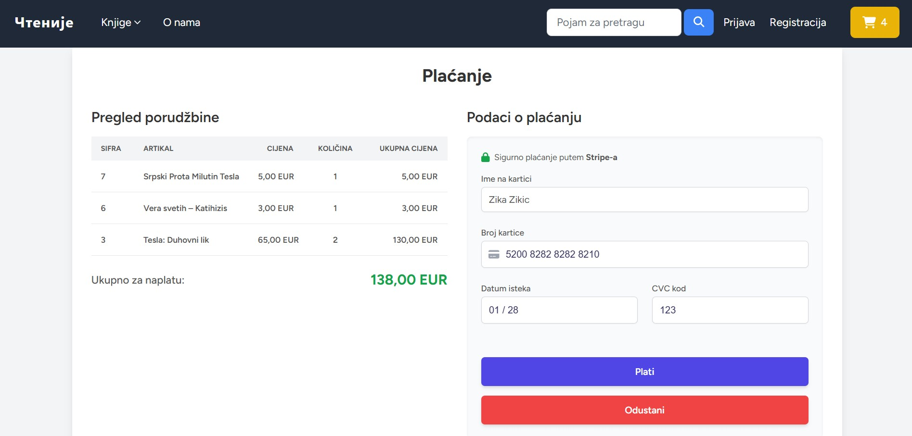
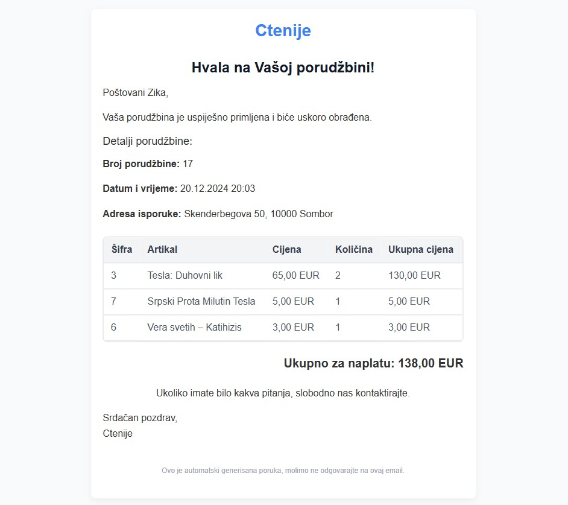

  

## About the project
This is a web application for an online bookstore called "Čtenije". 
The application provides all the basic functionalities that an online store should have:

- User registration and login
- Email address verification
- Updating user's personal information
- Deleting user account
- Browsing items by categories
- Adding items to the shopping cart
- Viewing items in the shopping cart
- Incrementing/decrementing shopping cart item quantity
- Removing items from the shopping cart
- Entering delivery information
- Entering payment information
- Payment cancelation
- Email notification with order details

The implementation enables the complete purchasing process for both registered and unregistered users (guests). In addition to the mentioned functionalities intended for customers and visitors, the application also allows employees to hierarchically monitor and manage the operation of the online store. A separate part of the system has been created, accessible only to authorized users (employees). The employee hierarchy implies two roles - Administrator and Manager.
In the administration part of the system, the following actions are enabled:

- Viewing basic business information
- Viewing and deleting users
- Viewing, adding and deleting managers
- Viewing items
- Viewing individual items
- Adding, editing and deleting items
- Viewing all orders
- Viewing order details

## Applied Technologies
These are the tehcnologies which were used for the development of this web application:

- PHP
- Laravel
- MySQL
- Stripe
- HTML
- CSS
- TailWind CSS
- JavaScript
- AlpineJS

## ER Diagram
Entities with a blue header represent database tables which were automatically generated by Laravel.

## Application GUI
Login 

Register

App notification to verify the email address 

Main page - section "Book of the year"

Books by category - History

Book details

Shopping cart

Payment

Payment confirmation by Email, with order details.

## Problems and challenges
These are some of the problems and challenges encountered during development:

- Where to store the data that an unregistered user enters in the delivery information form? 
**By resolving this problem I learned session data management for the order process**

- When an **item** that is linked to an **order item** is deleted, that order item is also deleted. 
**This is a common challenge in e-commerce development. By resolving this problem I learned about database table constraint variants, and Laravel's soft-deletion method**

## Next improvements
These are some possible new functionalities and improvements which should be implemented next:

- Redesign of the database due to current data redundancy
- Book recommendation system
- Author and Publisher pages
- View books by author, publisher, popularity, and price
- Search by entering the book name
- Optional discount code entry in the shopping cart
- Multiple payment methods
- Book rating
- Comments

## License
[MIT license](https://opensource.org/licenses/MIT).

